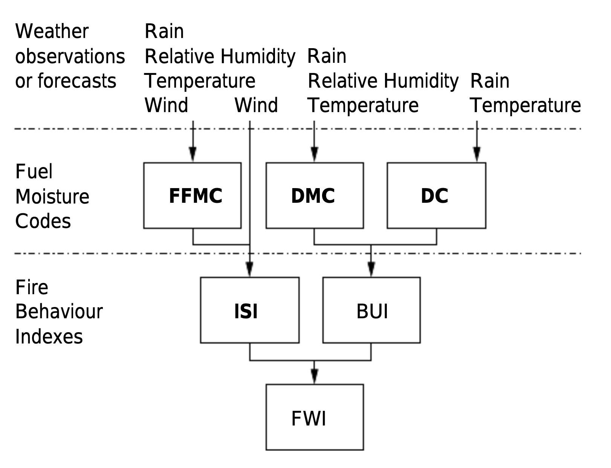

<h1> Firewatch </h1>

 Firewatch is a data exploration project based upon the work accomplished in the paper: 

<blockquote>
   <i> A Data Mining Approach to Predict Forest Fires using Meteorological Data by Paulo Cortez and A. Morais </i>
</blockquote>

  The project includes a machine learning predictive model for detecting forest fires with a <b>~96.3%</b> accuracy, alongside a data analysis and visualization of the dataset provided in the referenced paper. It was built using Python and Markdown in Jupyter Notebook over the span of three weeks. Further details into how each individual part was built are provided below.

<h2> Machine Learning Model </h2>

 The predictive model, found in <code>ForestFireImagePredictiveModel.ipynb</code>, used for detecting forest fires by image, was built in Python using <b>Keras</b> with <b>Tensorflow</b>. Data handling and manipulation was done with <b>NumPY</b> and <b>Pandas</b>, while data visualizations was created using <b>Matplotlib</b> and <b>Pillow</b>. The model was trained on a dataset of 1,900 images with about half including forest fires and half not including forest fires. 

This was model was created by:

<ol>
  <li>Preprocessing and organizing data into a structure that Keras could easily understand and divide.</li>
  <li>Dividing the data into testing and training datasets. We opted for a standard 80% training / 20% testing split. </li>
  <li>Constructing a sequential (linear) Keras model from a Rescaling layer, Flattening layer, Output layer, and several Convolution and MaxPooling layers.</li>
  <li>Compiling and fitting the model to our data splits over 10 epochs. This produced a model with about a <b>~92.6%</b> accuracy.</li>
  <li>Visualizing the model's accuracy and loss functions to find that it was overfitting to the dataset (not properly generalizing). To counteract this, we incorporated data augmentation to produce more test cases for our model and dropout to decrease the chance of our model developing patterns in the training dataset.</li>
  <li>After recompiling and refitting our model, we found it was more appropriately following trends set by the accuracy and loss functions in the testing dataset, and producing a more consistent <b>96.3%</b> accuracy.</li>
  <li>Finally, we provided unit tests for the model by sourcing several images from Google and Kaggle. Our model correctly passed all of these tests with high degrees of accuracy on familiar cases.</li>
</ol>

<h3> Initial Accuracy and Loss Functions</h3>

<h3> Final Accuracy and Loss Functions</h3>

<h2> Data Analysis and Visualization </h2>

The data analysis and visualization for the dataset in the referenced paper, found in <code>ForestFireDataAnalysis.ipynb</code>, was an initial exploration into the applications of machine learning in detecting forest fires. This was created in Python, where the data handling was done by <b>NumPY</b> and <b>Pandas</b>, and the data visualization was done by <b>Matplotlib</b> and <b>Seaborn</b>. The following were done to process, understand, and visualize the data:

<ol>
  <li>
    

    The dataset provided has eleven parameters that describe the location, weather conditions, and, consequently, the amount of area that was burned as a result from forest fires. To understand these parameters, we need to understand the Forest Weather Index (FWI). The FWI is a <i> "Canadian system for rating fire danger" </i> composed of the following six components.
    

    <ul>
        <li>FFMC (Fine Fuel Moisture Code): denote the moisture content surface litter and influences ignition and fire spread</li>
        <li>DMC (Duff Moisture Code): denotes the moisture content code of shallow organic layers - combines with the DC. </li>
        <li>DC (Drought Code): denotes the moisture content code of deep organic layers - combines with the DMC. </li>
        <li>ISI (Initial Spread Index): a score that correlates with fire velocity spread.</li>
        <li>BUI (Buildup Index): the amount of available fuel. </li>
        <li>FWI (Forest Weather Index): an indicator of fire intensity composed from ISI and BUI.</li>
    </ul>
    
  </li>
  <li>
    
As well as this, we need to understand how researchers divided up Montesinho Natural Park. To visualize this, we produced the following graphic:

    
  </li>
  <li>
    
Now that we have processed and understood our data, we were able to produce the following heatmap visualizations using <b>Seaborn</b>.

    <h3>Meteorological Data Visualizations</h3>
    
    
    <h3>Forest Weather Index Data Visualizations</h3>
    
    
  </li>
</ol>

After this visualization, some concluding thoughts were offered about what we can assess from this data in relation to detecting and preventing forest fires, and what additional measures could be taken for the researchers maintaining this dataset to improve the data.

